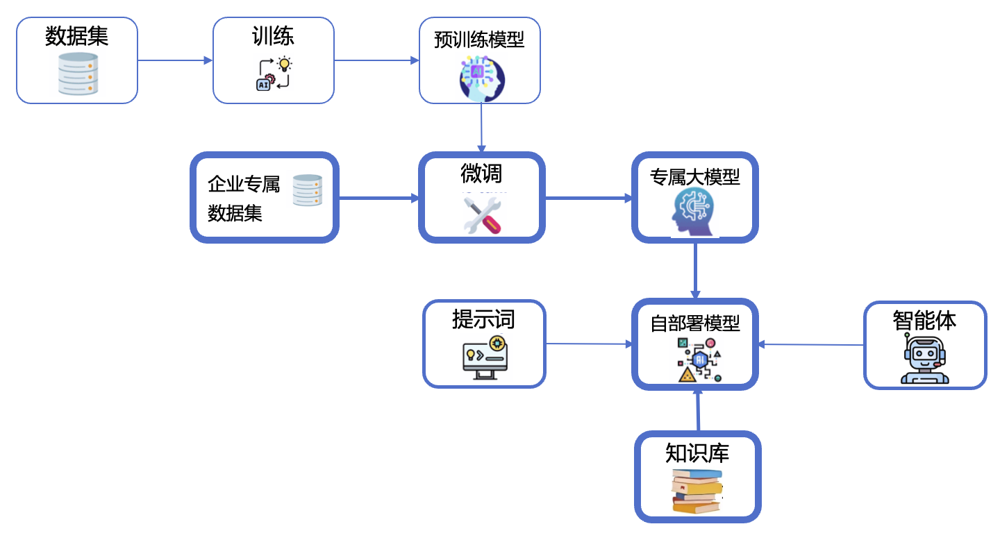

# 微调、知识库与智能体如何共同驱动企业级 AI 变革

AI 驱动的数字化转型，早已不只是接入一个聊天机器人或者用 AI 处理某个单一任务。真正有价值的，是构建一个**智能的、面向业务的整体系统**。

---

在我们的另一篇文章 *[how-agents-work-as-team.md]* 中，我们讲过 AI 智能体就像一个团队，每个成员各司其职，协作完成复杂任务。而当你开始推进第一个企业 AI 项目时，可能已经听过不少术语：**预训练大模型（LLM）**、**微调（Fine-Tuning）**、**RAG（检索增强生成）**、**知识库**、**智能体（Agent）**……

这些概念听起来各自独立，其实是一个系统的多个组成部分。在本文中，我们将从企业 AI 数字化的角度，讲清楚这几部分是如何相互连接、协同工作，从而构建一个真正可用、可控的智能系统。

---

{ style="display: block; margin: auto; width: 600px;" }

---

## 从预训练模型和企业数据开始

如今大多数 AI 项目，都是基于一个已经在海量公共数据上训练好的大型语言模型（LLM）起步的，比如 DeepSeek 或 Qwen。它们擅长写诗、总结文章、解数学题，也能做语言翻译。但面对企业中的复杂现实，它们仍有明显不足。它们不了解你们专家积累多年的经验，不懂你们是如何在各种限制条件下解决问题的，也不理解那些业务中特有的需求和判断标准。

要让 AI 真正服务于企业，就必须让它理解你的世界——你的产品、术语、流程和思维方式。而这正是你们的企业数据与专业知识发挥价值的地方。

---

## 让模型理解你的业务

“微调”就是把通用模型变成你自己的方式。你给它喂入公司内部的数据，比如文档、聊天记录、报告、邮件、操作手册等，帮助它逐步掌握你行业和企业的知识。

微调后的模型，不再是那个泛泛而谈的通才，而是你公司内部的“专家”。它能够讲你们的“行话”，理解你们的业务逻辑。对于金融、制造、供应链、技术支持等行业，这一步是从“能用”到“好用”的关键。

---

## 让模型知道它还不知道的事

但业务每天都在变化：新流程上线，新产品发布，知识库不断更新。总不能每次改点东西就重训一次模型吧？

这时就需要 **RAG（检索增强生成）** 登场了。RAG 让模型在回答问题前，先去知识库里搜索相关信息，然后再结合结果生成回答。就像一个靠谱的助理，总是先查资料、再作答。

有了 RAG，模型不必“记住一切”，也能随时调用企业最新、最权威的内容。它让 AI 回答更可信，也更有根据。

---

## 把智能落地为行动：AI 智能体

当模型已经理解了你的领域、可以实时访问知识，还缺一样东西：行动力。

智能体（Agent）正是让 AI 真正“动起来”的关键。它不只是个聊天框，而是能够：

- 理解用户意图
- 制定执行步骤
- 检索、调用模型和知识
- 触发自动化操作
- 必要时交给人工接手

在企业中，智能体可以成为：

- 员工内部的数字助理
- 面向客户的服务机器人
- 自动生成报告的运营助手
- 管控工作流的智能监控器

不是简单的工具，而是**具备思考和协作能力的业务助手**。

---

## 一切如何协同工作？

我们可以这样理解：

- **预训练模型** 是智能的大脑
- **微调** 让它理解你的业务
- **RAG** 给它随时查阅知识的能力
- **智能体** 则让它真正动手完成任务

这几部分协作后，就能构建一个自我适应、不断进化的企业 AI 系统，既可部署在本地保障安全，又具备高度可控性。

---

## 总结

企业使用 AI，不只是追求更快的答案或更炫的界面。真正的价值，是打造一套**懂你业务、贴合流程、能独立行动**的智能系统。

有了微调、RAG 和智能体的协同，你的 AI 不再是静态的工具，而是一个**能思考、能学习、能执行**的“活系统”。
