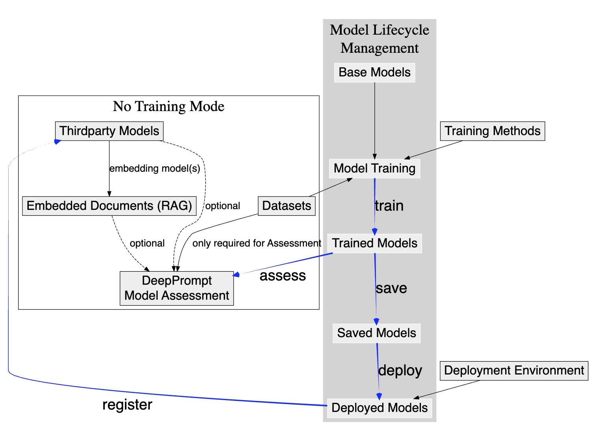

# Process Dependency

This guide gives you a simple overview of how different parts of **DeepExtension** connect with each other.  
It answers a key question:

> What do I need to prepare before running training, doing inference, or starting an assessment?

---

## Understanding the Diagram

Here’s how to read the arrows:

- **Black solid arrows** show something that is **required** before another step.
- **Black dashed arrows** show an **optional connection** — useful, but not required.
- **Blue arrows** show a process that **creates** a new model state (like training or saving).  
  These are **not real dependencies**, but part of the model’s journey.

---

## To Start Your First Model Training

You need:

- A **Base Model** (see [Base Models](../user-guide/base-models.md))
- A **Dataset** (see [Dataset Management](../user-guide/dataset-management.md))

Don’t worry about training methods — some are already built in.

➡️ Once ready, try this tutorial:  
[Quick Start: Run Your First Training](tutorial-quick-start.md)

---

## To Start Prompt Inference (Try a Prompt with a Model)

To run a prompt with **DeepPrompt**, you need a model.  
You can use:

- A model you’ve just trained
- A third-party model

You can also attach an **Embedded Document** (Knowledge Base), but that’s optional.  
See [DeepPrompt](../user-guide/deep-prompt.md) and [Document Embedding](../user-guide/document-embedding.md)

---

## To Start a Model Assessment

To compare two models or test a model’s quality, use **Model Assessment**.

You’ll need:

- One or more models (trained, or third-party)
- A dataset (used to generate test questions)

More in [Model Assessment](../user-guide/model-assessment.md)

---

## What If I Installed in “No-Training Mode”?

Some users may install DeepExtension **without training capabilities**.  
This is useful for:

- RAG-style applications
- Knowledge base construction
- Trying out third-party models

In that case, only the parts in the **left box** of the diagram are active.  
(You won’t be able to run training or save/deploy models.)

For more info, see the [Installation Guide](../developer/install.md)

---

## Model Lifecycle (The Right Box)

If you installed the full version, you can use the **Model Lifecycle Management** flow:

- Train → from base + dataset → to create a **Trained Model**
- Assess → use **DeepPrompt** or **Model Assessment** to evaluate **Trained Models** in real-time or background mode
- Save → converts a trained model into a **Saved Model**
- Deploy → turns a saved model into a **Deployed Model** that is ready for real-time use
- Register → allows your deployed model to be reused like third-party ones

These are all blue arrows in the diagram.

---

That’s it! This map helps you understand where you are and what’s next.
