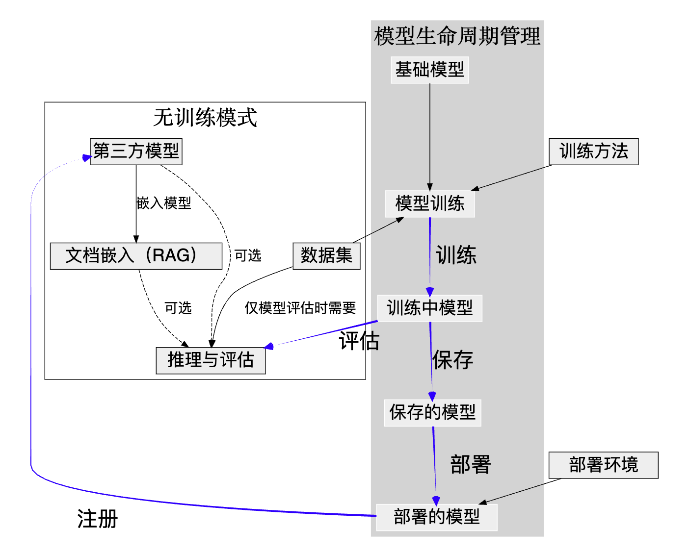

# 流程依赖关系

本指南将为你简要说明 **DeepExtension** 中各个模块之间的连接关系。  
它回答了一个关键问题：

> 在开始训练、执行推理或进行评估之前，我需要准备什么？

---

## 如何理解下图

箭头的含义如下：

- **黑色实线箭头** 表示在进行后续步骤前，必须先完成该步骤。
- **黑色虚线箭头** 表示可选连接 —— 有帮助但不是必需的。
- **蓝色箭头** 表示一个过程将生成新的模型状态（例如训练或保存）。  
  这些不是严格的依赖，而是模型生命周期的一部分。

---

## 如何开始第一次模型训练

你需要：

- 一个 **基础模型**（见 [基础模型](../user-guide/base-models.zh.md)）
- 一个 **数据集**（见 [数据集管理](../user-guide/dataset-management.zh.md)）

无需担心训练方法 —— 系统中已内置了一些方法。

➡️ 一切准备就绪后，请参考教程：  
[快速开始：运行你的第一次训练](tutorial-quick-start.zh.md)

---

## 如何开始提示推理（尝试使用模型运行提示）

若要使用 **DeepPrompt** 执行提示推理，你需要一个模型，来源可以是：

- 你刚训练完成的模型
- 第三方模型

你也可以附加一个 **嵌入文档**（知识库），但这是可选项。  
参考 [DeepPrompt](../user-guide/deep-prompt.zh.md) 与 [文档嵌入](../user-guide/document-embedding.zh.md)

---

## 如何开始模型评估

若要对两个模型进行对比，或测试模型的输出质量，请使用 **模型评估** 模块。

你需要准备：

- 一个或多个模型（训练模型或第三方模型）
- 一个数据集（用于生成评估问题）

详情见 [模型评估](../user-guide/model-assessment.zh.md)

---

## 如果我是以“无训练模式”安装的怎么办？

某些用户可能以 **无训练能力模式** 安装了 DeepExtension。  
适合以下场景：

- RAG 类型应用
- 构建知识库
- 测试第三方模型

在这种情况下，你只能使用图中 **左侧区域** 所涵盖的流程。  
（你无法运行训练，也无法保存或部署模型。）

详细说明请参考 [安装指南](../developer/install.zh.md)

---

## 模型生命周期（右侧区域）

如果你安装的是完整版本，则可以使用 **模型生命周期管理流程**：

- 训练（Train）→ 从基础模型和数据集出发 → 创建一个 **训练模型**
- 评估（Assess）→ 使用 **DeepPrompt** 或 **模型评估** 对 **训练模型** 进行实时或批量评估
- 保存（Save）→ 将训练模型转化为独立的 **已保存模型**
- 部署（Deploy）→ 将保存模型部署为可用于实时推理的 **已部署模型**
- 注册（Register）→ 将部署后的模型注册为类似于第三方模型的可复用资源

这些都对应图中的蓝色箭头。

---

就是这样！  
这张流程图能帮助你快速理解你现在在哪个阶段、下一步该做什么。